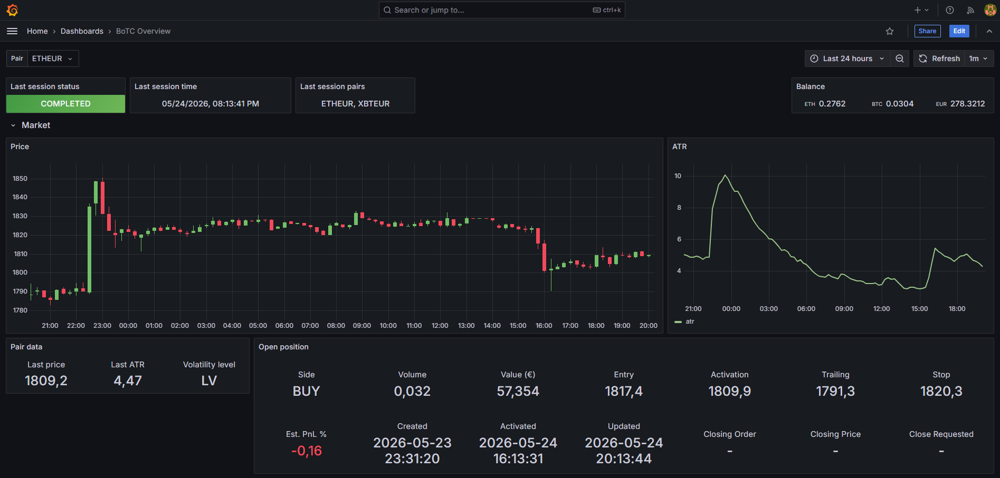
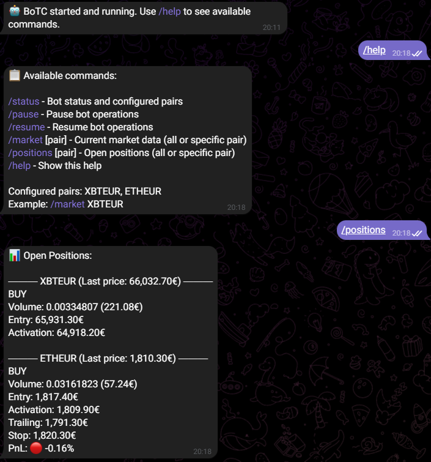
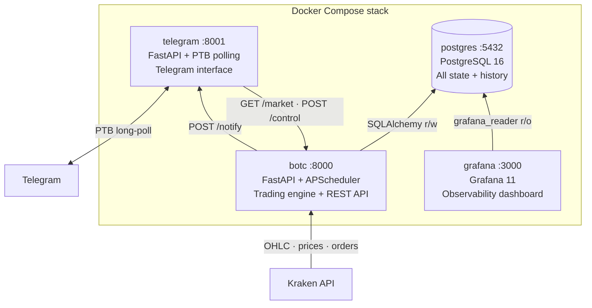
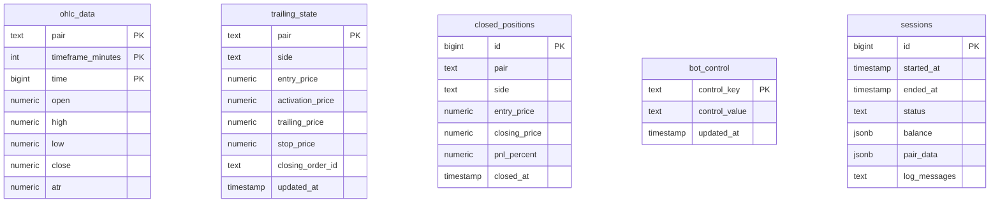

# BoTCoin — Autonomous Trading Bot Backend

[](https://github.com/jAjiz/BoTCoin/actions/workflows/ci.yml)
[](https://github.com/jAjiz/BoTCoin/actions/workflows/ci.yml)
[](https://www.python.org/downloads/release/python-3120/)

BoTCoin is a production-grade backend service built using modern Python engineering practices. It runs an ATR-based trailing-stop strategy against Kraken's EUR pairs, persists all state in PostgreSQL, exposes a REST control surface via FastAPI, ships a Grafana observability layer, and is operated through a Telegram bot controller for monitoring and on-the-fly control. The entire stack starts with a single `docker compose up`.

<table>
  <tr>
    <td></td>
    <td></td>
  </tr>
</table>

---

## Architecture


```mermaid
graph BT
    subgraph stack["Docker Compose stack"]
        direction TB
        botc["botc :8000\nFastAPI + APScheduler\nTrading engine + REST API"]
        telegram["telegram :8001\nFastAPI + PTB polling\nTelegram interface"]
        postgres[("postgres :5432\nPostgreSQL 16\nAll state + history")]
        grafana["grafana :3000\nGrafana 11\nObservability dashboard"]
    end

    kraken["Kraken API"]
    tg["Telegram"]

    kraken -->|"OHLC · prices · orders"| botc
    botc -->|"SQLAlchemy r/w"| postgres
    grafana -->|"grafana_reader r/o"| postgres
    telegram -->|"GET /market · POST /control"| botc
    tg <-->|"PTB long-poll"| telegram
    botc -->|"POST /notify"| telegram
```

Two application containers share one network. `botc` is the sole writer to every table. `telegram` is a thin API client — it reads and controls the bot exclusively through `botc`'s REST endpoints. Grafana reads the same database through a least-privilege `grafana_reader` role created by an Alembic migration.

---

## Quick start

```bash
cp .env.example .env   # fill in required values — see docs/configuration.md
docker compose up -d --build
```

| Service | URL |
|---|---|
| Trading API (Swagger UI) | http://localhost:8000/docs |
| Grafana dashboard | http://localhost:3000 |

```bash
docker compose logs -f botc        # watch trading sessions
docker compose down                # stop all services
```

---

## Key engineering decisions

Each decision links to its phase in the roadmap — execution plans and design rationale are linked from there.

| Technology | Why it was chosen | Reference |
|---|---|---|
| Docker | Ships the whole four-service stack as one image so it runs identically on a laptop and the VPS — no host Python or dependency drift. | [Roadmap](docs/v2/ROADMAP.md#phase-1--infrastructure-first-docker-completed) |
| APScheduler | The bot works by running a trading session on a fixed interval, over and over. A lightweight in-process scheduler is the simplest, cleanest way to do that — no separate worker or task queue to run and maintain. | [Roadmap](docs/v2/ROADMAP.md#phase-2--managed-execution-apscheduler-completed) |
| pytest | Fixtures + monkeypatch fit the mock-the-exchange testing style; the unit/integration split runs inside Docker so tests hit the same image and Postgres as production. | [Roadmap](docs/v2/ROADMAP.md#phase-3--testing-strategy-completed) |
| PostgreSQL | One reliable store for all trading state and history, with transactions to keep that state consistent. Sync SQLAlchemy because the loop ticks every few seconds — no concurrent load to justify async. | [Roadmap](docs/v2/ROADMAP.md#phase-4--professional-persistence-postgresql-completed) |
| FastAPI | Async REST layer with built-in validation and OpenAPI docs; `botc` and `telegram` are split so Telegram's blocking long-poll can never stall the trading loop. | [Roadmap](docs/v2/ROADMAP.md#phase-5--rest-api-layer-fastapi-completed) |
| ruff | One Rust-fast tool replaces flake8 + black + isort for lint, format, and import sorting, configured solely in `pyproject.toml`. | [Roadmap](docs/v2/ROADMAP.md#phase-6--code-quality-linting--type-safety-completed) |
| GitHub Actions + GHCR | Build the image once in CI and deploy by tag; the VPS pulls from GHCR and holds only `.env` + compose files — no source clone or on-host build. | [Roadmap](docs/v2/ROADMAP.md#phase-7--cicd-pipeline-completed) |
| Grafana | A ready-made observability dashboard that reads the bot's Postgres tables directly with plain SQL, so market data, positions, and performance are visible without building a custom UI. | [Roadmap](docs/v2/ROADMAP.md#phase-8--observability-grafana-dashboard-completed) |
| Optuna | The original optimizer tried every parameter combination one by one (an exhaustive grid scan), which was slow and didn't scale. Optuna searches intelligently for good parameters instead, and now runs as an API endpoint in a background process with its jobs saved in Postgres. | [Roadmap](docs/v2/ROADMAP.md#phase-10--trading-tools-integration-backtest--optimizer-completed) |

Full design rationale is in [CLAUDE.md](CLAUDE.md) under **Design choices**.

---

## Data model

Five PostgreSQL tables managed by a single Alembic migration chain (`scripts/migrations/versions/`):


```mermaid
erDiagram
    ohlc_data {
        text pair PK
        int timeframe_minutes PK
        bigint time PK
        numeric open
        numeric high
        numeric low
        numeric close
        numeric atr
    }

    trailing_state {
        text pair PK
        text side
        numeric entry_price
        numeric activation_price
        numeric trailing_price
        numeric stop_price
        text closing_order_id
        timestamp updated_at
    }

    closed_positions {
        bigint id PK
        text pair
        text side
        numeric entry_price
        numeric closing_price
        numeric pnl_percent
        timestamp closed_at
    }

    bot_control {
        text control_key PK
        text control_value
        timestamp updated_at
    }

    sessions {
        bigint id PK
        timestamp started_at
        timestamp ended_at
        text status
        jsonb balance
        jsonb pair_data
        text log_messages
    }
```

**Data flow for a completed trade:**

```
Kraken API
  → fetch_ohlc_data()  →  ohlc_data  (upsert, every session)
  → get_balance() + get_last_prices()  →  core/runtime  (in-memory only)

create_position()
  →  trailing_state  (INSERT: side, entry, activation_price)

tick_position() × N sessions
  →  trailing_state  (UPDATE: trailing_price, stop_price)

close_position()
  →  trailing_state  (UPDATE: closing_order_id, approximate closing_price)

is_closing_complete()  — Kraken QueryOrders confirms fill
  →  closed_positions  (INSERT: real fill price, pnl_percent)
  →  trailing_state  (DELETE)
```

---

## Roadmap & future work

BoTCoin reached its goal of a production-grade backend service and that milestone is now closed — see the archived [V2 roadmap](docs/v2/ROADMAP.md) for the full delivered scope.

Active and planned work lives in [docs/ROADMAP.md](docs/ROADMAP.md). Next up: a Choppiness Index–based **trend/chop regime filter** that suppresses new entries in sideways markets, leaving the trailing-stop exit untouched.

---

## Documentation

| Document | Contents |
|---|---|
| [docs/configuration.md](docs/configuration.md) | Every `.env` variable, its default, and its effect |
| [docs/trading-strategy.md](docs/trading-strategy.md) | ATR classification, K_STOP calibration, position lifecycle |
| [docs/operations.md](docs/operations.md) | Local dev, production deploy, rollback, monitoring, troubleshooting |
| [docs/CHANGELOG.md](docs/CHANGELOG.md) | Phase-by-phase change history |
| [docs/ROADMAP.md](docs/ROADMAP.md) | Active (V3) roadmap |
| [docs/v2/ROADMAP.md](docs/v2/ROADMAP.md) | Archived V2 roadmap (closed) and phase plans |

---

## Contributing

Issues and pull requests are welcome. See [CLAUDE.md](CLAUDE.md) for coding conventions, design decisions, and testing requirements.

---

*Cryptocurrency trading involves substantial financial risk. This software is not financial advice. Use at your own risk.*
