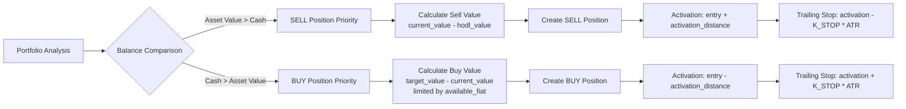
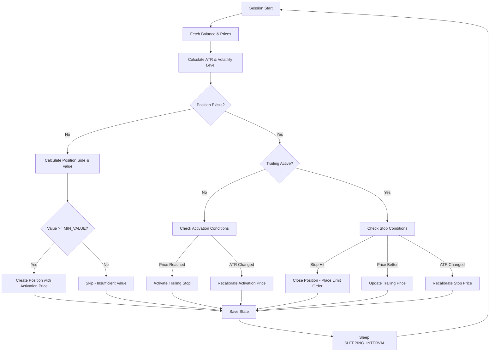

# BoTCoin - Autonomous Digital Asset Manager

BoTCoin is a 24/7 autonomous digital asset management system that analyzes market conditions in real-time and dynamically adapts trading behavior based on measured volatility. The system integrates with Kraken exchange and provides real-time monitoring and alerts through Telegram.

---

## 📑 Table of Contents

- [System Overview](#-system-overview)
- [Architecture & Trading Engine](#-architecture--trading-engine)
- [Data Analysis & Volatility Regimes](#-data-analysis--volatility-regimes)
- [Persistence & Data Structure](#-persistence--data-structure)
- [Exchange Integration](#-exchange-integration)
- [Telegram Integration](#-telegram-integration)
- [Simulation & Optimization](#-simulation--optimization)
- [Configuration & Deployment](#-configuration--deployment)
- [Quick Start](#-quick-start)
- [Project Structure](#-project-structure)
- [Testing](#-testing)
- [Security Considerations](#-security-considerations)
- [Performance Metrics](#-performance-metrics)
- [Technical Highlights](#-technical-highlights)
- [Contributing](#-contributing)
- [License & Disclaimer](#-license--disclaimer)

---

## 🎯 System Overview

BoTCoin operates as an autonomous trading agent that:

- **Analyzes Market State**: Continuously monitors market conditions using technical indicators (ATR - Average True Range)
- **Adaptive Behavior**: Dynamically adjusts trading parameters based on current volatility levels
- **Balance-Based Decision Logic**: Prioritizes operations based on portfolio composition (asset vs. cash predominance)
- **Risk Management**: Implements trailing stop mechanisms with volatility-adjusted distances
- **Real-Time Monitoring**: commands, alerts, and position tracking

### ✨ Key Features

- 📊 **Real-Time Market Analysis** using Pandas DataFrames and Numpy vectorized calculations
- 🎚️ **5-Level Volatility Classification** (LL, LV, MV, HV, HH) based on ATR percentiles
- 📱 **Telegram Bot Interface** for monitoring and control
- 🔐 **Secure Configuration** via environment variables
- 🚀 **Automated CI/CD** deployment through GitHub Actions
- 💾 **Data Persistence** with PostgreSQL for all runtime state, history, and market data
- 🔄 **24/7 Autonomous Operation** on Google Cloud Platform (Free Tier VPS)

## 🏗️ Architecture & Trading Engine

### Core Trading Logic

The system implements a **balance-majority decision logic**:

1. **Position Creation** (`create_position`):
   - Analyzes portfolio balance between asset and cash
   - If **asset predominates** → prioritizes **SELL** positions
   - If **cash predominates** → prioritizes **BUY** positions
   - Calculates activation price based on:
     - Activation coefficient (`K_ACT`)
     - Stop coefficient + margin (`K_STOP + MIN_MARGIN`)

### Decision Logic Diagram


```mermaid
graph LR
    A[Portfolio Analysis] --> B{Balance Comparison}
    B -->|Asset Value > Cash| C[SELL Position Priority]
    B -->|Cash > Asset Value| D[BUY Position Priority]
    
    C --> E[Calculate Sell Value<br/>current_value - hodl_value]
    D --> F[Calculate Buy Value<br/>target_value - current_value<br/>limited by available_fiat]
    
    E --> G[Create SELL Position]
    F --> H[Create BUY Position]
    
    G --> I[Activation: entry + activation_distance]
    H --> J[Activation: entry - activation_distance]
    
    I --> K[Trailing Stop: activation - K_STOP * ATR]
    J --> L[Trailing Stop: activation + K_STOP * ATR]
```

2. **Position Management** (`update_trailing_state`):
   - **Pre-Activation Phase**: Monitors activation price and recalibrates if ATR changes significantly
   - **Post-Activation Phase**: Implements trailing stop mechanism
   - **Dynamic Recalibration**: Adjusts stop distances when ATR deviates beyond `ATR_DESV_LIMIT`

3. **Position Closure** (`close_position`):
   - Executes limit orders when stop price is hit (lower fees than market orders)
   - Calculates and logs P&L (Profit/Loss percentage)
   - Persists closed position data for historical analysis

### Trading Flow


```mermaid
graph TD
    A[Session Start] --> B[Fetch Balance & Prices]
    B --> C[Calculate ATR & Volatility Level]
    C --> D{Position Exists?}
    
    D -->|No| E[Calculate Position Side & Value]
    E --> F{Value >= MIN_VALUE?}
    F -->|Yes| G[Create Position with Activation Price]
    F -->|No| H[Skip - Insufficient Value]
    
    D -->|Yes| I{Trailing Active?}
    
    I -->|No| J[Check Activation Conditions]
    J -->|Price Reached| K[Activate Trailing Stop]
    J -->|ATR Changed| L[Recalibrate Activation Price]
    
    I -->|Yes| M[Check Stop Conditions]
    M -->|Stop Hit| N[Close Position - Place Limit Order]
    M -->|Price Better| O[Update Trailing Price]
    M -->|ATR Changed| P[Recalibrate Stop Price]
    
    G --> Q[Save State]
    K --> Q
    L --> Q
    N --> Q
    O --> Q
    P --> Q
    H --> Q
    
    Q --> R[Sleep SLEEPING_INTERVAL]
    R --> A
```

## 📊 Data Analysis & Volatility Regimes

### Market Data Processing

The system uses Pandas DataFrames for efficient market data manipulation and Numpy for vectorized statistical calculations:

- **OHLC Data Ingestion**: Fetches candlestick data from Kraken via `fetch_ohlc_data`
- **ATR Calculation**: Rolling window calculation using True Range components (H-L, H-PC, L-PC)
- **Historical Persistence**: Stores market data in the `ohlc_data` PostgreSQL table; CSV caches under `data/` are consumed by offline analysis tools only
- **Incremental Updates**: Appends only new candles using upsert semantics (`ON CONFLICT DO NOTHING`)

### Volatility Classification

The system classifies market conditions into **5 volatility levels** based on ATR percentiles:

| Level | Range | Description |
|-------|-------|-------------|
| **LL** | < P20 | Very Low Volatility |
| **LV** | P20-P50 | Low Volatility |
| **MV** | P50-P80 | Medium Volatility |
| **HV** | P80-P95 | High Volatility |
| **HH** | > P95 | Very High Volatility |

The system determines the current volatility level for each pair by comparing the calculated ATR against these percentile thresholds.

### Structural Noise Analysis

The `analyze_structural_noise` function identifies market pivot points and calculates maximum drawdown/bounce (K values) for each volatility level:

- **Pivot Detection**: Uses `scipy.signal.argrelextrema` to identify local minima and maxima
- **Trend Segmentation**: Separates uptrends (min→max) and downtrends (max→min)
- **K-Value Calculation**: For each volatility segment, computes `K = max_deviation / ATR`
- **Statistical Distribution**: Provides percentile-based K_STOP recommendations (P50, P75, P90, P95, P100)

### Dynamic K_STOP Calculation

The system uses `calculate_trading_parameters` and `calculate_k_stops` from `parameters_manager.py` to dynamically compute stop distances:

1. **Event Analysis**: `analyze_structural_noise` returns uptrend and downtrend events with K-values per volatility level
2. **Percentile Selection**: For each volatility level (LL, LV, MV, HV, HH), `calculate_k_stops` selects the K-value at the configured percentile (from `.env` STOP_PCT variables)
3. **Stop Assignment**: 
   - SELL positions use K_STOP from uptrend events (drawdown resistance)
   - BUY positions use K_STOP from downtrend events (bounce resistance)
4. **Runtime Application**: `get_k_stop` retrieves the appropriate K_STOP value based on current volatility level and position side

## 💾 Persistence & Data Structure

Phase 4 introduces Alembic-backed PostgreSQL schema management. The initial migration bootstrap lives in `alembic.ini` and `scripts/migrations/`, and migrations run against `DATABASE_URL`.

### Database Migrations

Use Alembic for schema changes instead of ad hoc SQL:

```bash
alembic upgrade head
```

To generate a new revision after Phase 4 changes:

```bash
alembic revision -m "describe change"
```

### State Management

State (active trailing state, closed positions, and bot control flags) is persisted in PostgreSQL via the centralized Data Access Layer implemented in `core/database.py`.

- **Active positions:** stored in the `trailing_state` table and accessed via DAL functions (`load_trailing_state`, `save_trailing_state`).
- **Closed positions:** stored in the `closed_positions` table and accessed via DAL functions (`save_closed_position`, `load_closed_positions`).

Legacy JSON files under `data/` (e.g., `trailing_state.json`, `closed_positions.json`) are deprecated and no longer used by the runtime.

### Data Sink Architecture

CSV files (`data/*_ohlc_data_*.csv`) are retained as read-only inputs for the offline analysis tools:

- **Backtest & Optimizer**: `trading/backtest.py` and `trading/optimize_params.py` consume CSV market data caches
- **Performance Analysis**: Enable post-operation backtesting and parameter optimization

All runtime persistence (OHLC ingestion, position state, closed positions, and bot control flags) is stored in PostgreSQL.

## 🔌 Exchange Integration

### Kraken API

**Current Scope**: EUR-based trading pairs only (supports multiple pairs simultaneously)

**Key Functions** (`exchange/kraken.py`):
- `get_balance()`: Retrieves account balances
- `get_last_prices(pairs)`: Fetches current market prices for all configured pairs
- `fetch_ohlc_data(pair, interval, since)`: Downloads historical candlestick data
- `place_limit_order(pair, side, price, volume)`: Executes limit orders
- `get_order_status(order_id)`: Checks order execution status

**Modular Design**: The architecture supports future expansion to:
- Other exchanges (Binance, Coinbase, etc.)
- Additional fiat currencies (USD, GBP, etc.)

## 📱 Telegram Integration

### Command Interface

The bot provides real-time interaction through Telegram commands:

| Command | Description |
|---------|-------------|
| `/help` | Display available commands and configured pairs |
| `/status` | Show bot operational status (RUNNING/PAUSED) |
| `/pause` | Pause trading operations (safe mode) |
| `/resume` | Resume trading operations |
| `/market [pair]` | Display current market data and balances |
| `/positions [pair]` | Show open positions with P&L estimates |

**Example**: Telegram interface in action

 

### Automated Alerts

The system sends real-time notifications for:
- ✅ Bot startup and configuration
- 🆕 New position creation
- ⚡ Position activation (trailing start)
- 💸 Position closure with P&L
- ⚠️ System errors and warnings

**Implementation**: Thread-safe communication between main trading loop and Telegram handler using `core.runtime` shared state.

## 🧪 Simulation & Optimization

### Backtest Module

**Purpose**: Validate trading strategies against historical data

**Key Features** (`trading/backtest.py`):
- Simulates full trading cycles with configurable parameters
- Accounts for exchange fees and slippage
- Calculates performance metrics (total return, number of operations, win rate)
- Supports date range filtering and operation limits

**Usage**:
```bash
PYTHONPATH=. python trading/backtest.py PAIR=XBTEUR FEE_PCT=0.26 START=2025-01-01 END=2026-01-01 MAX_OPS=50
```

### Optimizer Module

**Purpose**: Find optimal trading parameters through grid search

**Key Features** (`trading/optimize_params.py`):
- Exhaustive parameter combinations testing
- Multiple optimization modes:
  - **CONSERVATIVE**: Tests MIN_MARGIN configurations (entry price protection)
  - **AGGRESSIVE**: Tests K_ACT configurations (ATR-based activation)
  - **CURRENT**: Validates existing `.env` configuration
- Train/test split for validation
- Ranking method: ROBUST (median + IQR for outlier resistance)
- Configurable search space for K_ACT, K_STOP percentiles, and MIN_MARGIN

**Usage**:
```bash
PYTHONPATH=. python trading/optimize_params.py PAIR=XBTEUR MODE=CONSERVATIVE FEE_PCT=0.26 TRAIN_SPLIT=0.7
```

### ⚠️ Transparency Note

The **Backtest and Optimizer modules** have been developed with intensive AI assistance to accelerate prototyping and parameter optimization. While the core trading logic is manually designed and validated, these analytical components benefit from automated code generation for statistical calculations and performance evaluation.

## ⚙️ Configuration & Deployment

### Environment Variables

Create a `.env` file with the following configuration:

```bash
# Kraken API Credentials
KRAKEN_API_KEY=                    # Your Kraken API key
KRAKEN_API_SECRET=                 # Your Kraken API secret

# Telegram Bot Credentials (obtain from @BotFather)
TELEGRAM_TOKEN=                    # Bot token from @BotFather
TELEGRAM_USER_ID=                  # Your numeric Telegram user ID
TELEGRAM_POLL_INTERVAL=10          # Polling interval in seconds (default: 0)

# Bot Settings
SLEEPING_INTERVAL=60               # Seconds between trading sessions (default: 60)
PARAM_SESSIONS=720                 # Sessions before recalculating parameters (default: 720, ~12h)
CANDLE_TIMEFRAME=15                # Candle size in minutes (default: 15)
MARKET_DATA_DAYS=60                # Days of historical data to store (default: 60)
ATR_PERIOD=14                      # ATR calculation period in candles (default: 14)
ATR_DESV_LIMIT=0.2                 # ATR deviation threshold for recalibration (default: 0.2, 20%)
MIN_VALUE=10                       # Minimum operation value in EUR (default: 10)
MINIMUM_CHANGE_PCT=0.02            # Minimum price change for pivot detection (default: 0.02, 2%)

# Pairs
PAIRS=XBTEUR,ETHEUR                # Comma-separated list of trading pairs

# Asset Allocation (per pair)
XBTEUR_TARGET_PCT=80               # Target portfolio percentage for XBTEUR
XBTEUR_HODL_PCT=20                 # Minimum hold percentage (don't sell below this)

ETHEUR_TARGET_PCT=20               # Target portfolio percentage for ETHEUR
ETHEUR_HODL_PCT=0                  # Minimum hold percentage for ETHEUR

# Trading Parameters (per pair)
# XBTEUR uses MIN_MARGIN strategy (no K_ACT defined)
XBTEUR_MIN_MARGIN=0.009            # Minimum profit margin for activation (0.9%)
XBTEUR_STOP_PCT_LL=0.95            # Stop percentile for Very Low volatility (95th)
XBTEUR_STOP_PCT_LV=0.90            # Stop percentile for Low volatility (90th)
XBTEUR_STOP_PCT_MV=0.65            # Stop percentile for Medium volatility (65th)
XBTEUR_STOP_PCT_HV=0.50            # Stop percentile for High volatility (50th)
XBTEUR_STOP_PCT_HH=0.50            # Stop percentile for Very High volatility (50th)

# ETHEUR uses K_ACT strategy (ATR-based activation)
ETHEUR_K_ACT=1.5                   # Activation coefficient (multiplies ATR)
ETHEUR_STOP_PCT_LL=0.90            # Stop percentile for Very Low volatility (90th)
ETHEUR_STOP_PCT_LV=0.25            # Stop percentile for Low volatility (25th)
ETHEUR_STOP_PCT_MV=0.99            # Stop percentile for Medium volatility (99th)
ETHEUR_STOP_PCT_HV=0.99            # Stop percentile for High volatility (99th)
ETHEUR_STOP_PCT_HH=0.90            # Stop percentile for Very High volatility (90th)
```

**Configuration Flexibility**:
- **K_ACT and MIN_MARGIN** can be configured per side (SELL/BUY) or common for both:
  - Common: `PAIR_K_ACT`, `PAIR_MIN_MARGIN`
  - Per side: `PAIR_SELL_K_ACT`, `PAIR_BUY_K_ACT`, `PAIR_SELL_MIN_MARGIN`, `PAIR_BUY_MIN_MARGIN`
- If **K_ACT** is defined, activation uses: `activation_distance = K_ACT * ATR`
- If **K_ACT** is not defined, activation uses: `activation_distance = K_STOP * ATR + MIN_MARGIN * entry_price`

## 🧪 Testing

The project uses a two-tier pytest strategy with Docker-first execution and an enforced coverage gate.

- **Unit tests** (`tests/unit`): pure logic tests for `core/`, `trading/`, and mocked exchange wrappers in `exchange/`.
- **Integration tests** (`tests/integration`): optional live Kraken connectivity checks, skipped by default unless explicitly enabled.
- **Coverage gate**: `pytest.ini` enforces `--cov-fail-under=80` across `core`, `trading`, and `exchange`.

### Local setup (without Docker)

```bash
pip install -r requirements-dev.txt
pytest tests
```

### Docker setup (recommended for parity)

```bash
docker compose -f docker-compose.test.yml build test
docker compose -f docker-compose.test.yml run --rm test pytest tests
```

The dedicated `test` service in `docker-compose.test.yml` sets `PYTHONPATH=/app`, so the container resolves the repo's flat module layout the same way as the local environment.

To run live Kraken integration tests, set:

```bash
RUN_LIVE_INTEGRATION=true
KRAKEN_API_KEY=...
KRAKEN_API_SECRET=...
```

Or override only for a single Docker run:

```bash
docker compose -f docker-compose.test.yml run --rm -e RUN_LIVE_INTEGRATION=true test pytest tests/integration
```

If live credentials are missing, integration tests are skipped automatically.

### Infrastructure

**Cloud Deployment**: Google Cloud Platform Free Tier VPS
- **Availability**: 24/7 operation
- **Reliability**: Automatic restart on failure
- **Cost**: Zero infrastructure cost

**CI/CD Pipeline** (`.github/workflows/deploy.yml`):

```yaml
name: Deploy BoTC

on:
  push:
    branches:
      - main

jobs:
  deploy:
    runs-on: ubuntu-latest
    steps:
    - name: Checkout repository
      uses: actions/checkout@v3
    
    - name: Execute remote deploy script via SSH
      uses: appleboy/ssh-action@0ff4204d59e8e51228ff73bce53f80d53301dee2 # v1.2.5
      with:
        host: ${{ secrets.VM_IP }}
        username: ${{ secrets.VM_USER }}
        key: ${{ secrets.VM_KEY }}
        script: "bash ~/deploy_BoTC.sh"
```

**Deployment Flow**:
1. Push code to `main` branch
2. GitHub Actions triggers deployment workflow
3. SSH connection to production VPS
4. Remote script pulls latest code
5. Service restart with zero downtime

### Configuration Validation & Logging

The system performs comprehensive validation on startup and provides detailed logging throughout operation:

**Startup Validation**:
```
[INFO] ============================================================
[INFO] ✅ CONFIGURATION VALIDATED SUCCESSFULLY
[INFO] ============================================================
[INFO] Telegram polling interval: 10s
[INFO] Session interval: 60s
[INFO] Parameter calculation sessions: 720
[INFO] Candle timeframe: 15min
[INFO] Market data storage: 120 days
[INFO] ATR period: 14 candles
[INFO] Pairs to trade: XBTEUR, ETHEUR
[INFO] ------------------------------------------------------------
```

**Session Logs**: Each trading session provides detailed information:
```
[INFO] ======== STARTING SESSION ========
[INFO] --- Processing pair: [XBTEUR] ---
[INFO] Calculating trading parameters...
[INFO] ATR percentiles → P20:100.0€ | P50:174.2€ | P80:291.9€ | P95:462.5€
[INFO] K_STOP_SELL → LL:2.90 | LV:3.30 | MV:4.30 | HV:1.60 | HH:1.40
[INFO] K_STOP_BUY  → LL:4.20 | LV:3.10 | MV:4.60 | HV:2.00 | HH:1.30
[INFO] Market: 66,381.2€ | ATR: 190.0€ (MV)
[INFO] --- Processing pair: [ETHEUR] ---
[INFO] Calculating trading parameters...
[INFO] ATR percentiles → P20:4.8€ | P50:8.0€ | P80:13.5€ | P95:21.7€
[INFO] K_STOP_SELL → LL:10.60 | LV:3.80 | MV:6.10 | HV:5.50 | HH:2.30
[INFO] K_STOP_BUY  → LL:11.40 | LV:2.60 | MV:6.50 | HV:6.80 | HH:3.20
[INFO] Market: 1,948.7€ | ATR: 10.2€ (MV)
[INFO] Session complete. Sleeping for 60s.

[INFO] ======== STARTING SESSION ========
[INFO] --- Processing pair: [XBTEUR] ---
[INFO] Market: 66,429.4€ | ATR: 191.1€ (MV)
[INFO] --- Processing pair: [ETHEUR] ---
[INFO] Market: 1,952.1€ | ATR: 10.4€ (MV)
[INFO] Session complete. Sleeping for 60s.
```

All logs include timestamps and are organized by:
- **Configuration validation**: System settings and pair configuration
- **Parameter calculation**: ATR percentiles and K_STOP values per volatility level
- **Market state**: Current price, ATR, and volatility classification
- **Position events**: Creation, activation, recalibration, and closure

## 🚀 Quick Start

### Docker

Two Compose files are provided:

| File | Purpose |
|---|---|
| `docker-compose.yml` | **Development** – bind-mounts `./data` and `./logs` so you can inspect files directly on the host. |
| `docker-compose.prod.yml` | **Production (VPS)** – layered override that switches to named volumes (fixes Linux ownership for the non-root container user), enforces `restart: always`, and adds runtime hardening. |

#### Development

1. Copy the environment template:

```bash
cp .env.example .env
```

2. Build and start the bot:

```bash
docker compose up -d --build
```

3. Watch logs:

```bash
docker compose logs -f botc
```

4. Stop services:

```bash
docker compose down
```

Optional PostgreSQL service:

> **Note:** This also starts the default `botc` service. To start only `postgres`, add it explicitly: `docker compose --profile data up -d postgres`.

```bash
docker compose --profile data up -d
```

#### Production (Linux VPS)

Layer the production override on top of the base file:

```bash
# First deploy
docker compose -f docker-compose.yml -f docker-compose.prod.yml up -d --build

# Watch logs
docker compose -f docker-compose.yml -f docker-compose.prod.yml logs -f botc

# Stop
docker compose -f docker-compose.yml -f docker-compose.prod.yml down
```

> **Note:** On production, `./data` and `./logs` are stored in Docker named volumes (`botc_data` and `botc_logs`). To find the exact runtime volume names run `docker volume ls | grep botc`, then inspect with `docker volume inspect <volume-name>` or copy files out with `docker cp`.

### Analysis Tools

Run analysis scripts using Docker:

**Market Structure Analysis**:
```bash
docker compose run --rm botc python trading/market_analyzer.py PAIR=XBTEUR Volatility=ALL SHOW_EVENTS
```

**Backtest Strategy**:
```bash
docker compose run --rm botc python trading/backtest.py PAIR=XBTEUR FEE_PCT=0.26 START=2025-01-01 END=2026-01-01
```

**Parameter Optimization**:
```bash
docker compose run --rm botc python trading/optimize_params.py PAIR=XBTEUR MODE=CONSERVATIVE FEE_PCT=0.26
```

Or run locally with Python (set `PYTHONPATH` so the flat module layout is resolvable):
```bash
PYTHONPATH=. python trading/market_analyzer.py PAIR=XBTEUR Volatility=ALL SHOW_EVENTS
PYTHONPATH=. python trading/backtest.py PAIR=XBTEUR FEE_PCT=0.26
PYTHONPATH=. python trading/optimize_params.py PAIR=XBTEUR MODE=CONSERVATIVE FEE_PCT=0.26
```

## 📈 Project Structure

```
BoTCoin/
├── main.py                      # Application entry point
├── alembic.ini                  # Alembic migration configuration
├── requirements.txt             # Python dependencies
├── .env                         # Configuration (not in repo)
│
├── core/
│   ├── config.py               # Configuration loader
│   ├── database.py             # Data Access Layer (PostgreSQL ORM + operations)
│   ├── runtime.py              # Thread-safe shared state
│   ├── logging.py              # Logging utilities
│   ├── utils.py                # Common utilities
│   └── validation.py           # Configuration validation
│
├── exchange/
│   └── kraken.py               # Kraken API integration
│
├── scripts/
│   ├── load_legacy_data.py     # One-time CSV/JSON → PostgreSQL migration
│   └── migrations/             # Alembic migration versions
│       └── versions/
│           └── 20260414_01_phase4_initial_schema.py
│
├── services/
│   └── telegram.py             # Telegram bot interface
│
├── trading/
│   ├── inventory_manager.py   # Portfolio calculation logic
│   ├── market_analyzer.py     # ATR and structural analysis
│   ├── parameters_manager.py  # Dynamic parameter calculation
│   ├── positions_manager.py   # Position lifecycle management
│   ├── backtest.py            # Historical simulation
│   └── optimize_params.py     # Parameter optimization
│
└── .github/
    └── workflows/
        └── deploy.yml          # CI/CD automation
```

## 🔒 Security Considerations

- **API Keys**: Never commit credentials; use environment variables exclusively
- **Authentication**: Telegram bot validates user ID before executing commands
- **Order Validation**: All operations require minimum value threshold
- **Rate Limiting**: Respects exchange API limits with sleep intervals
- **Error Handling**: Graceful degradation with notification on failures

## 📊 Performance Metrics

The system tracks and logs:
- **Position Metrics**: Entry/exit prices, ATR at decision points, P&L percentage
- **Market Metrics**: Volatility distribution, ATR percentiles, price movements
- **Operational Metrics**: Session count, position refresh cycles, recalibration events

## 🛠️ Technical Highlights

### Core Technologies
- **Python 3.x**: Main programming language
- **Pandas & Numpy**: High-performance data analysis
- **Scipy**: Advanced statistical calculations
- **AsyncIO**: Asynchronous Telegram bot integration
- **Threading**: Concurrent operation (trading loop + bot interface)

### Design Patterns
- **Modular Architecture**: Separation of concerns (trading, exchange, services)
- **Configuration as Code**: Environment-driven behavior
- **State Persistence**: PostgreSQL for all runtime state (trailing stop, closed positions, bot control, OHLC)
- **Thread-Safe State**: Locking mechanism for concurrent access

### Key Algorithms
- **ATR-Based Volatility**: Dynamic stop distances using True Range
- **Pivot Detection**: Local extrema identification with scipy
- **Trailing Stop**: Price-following mechanism with volatility adaptation
- **Balance-Majority Logic**: Portfolio-driven decision making

## 🤝 Contributing & Support

Contributions, bug reports, and suggestions are welcome! This project is primarily for educational purposes.

- **Author**: [jAjiz](https://github.com/jAjiz)
- **Repository**: [BoTCoin](https://github.com/jAjiz/BoTCoin)
- **Contact**: For questions or collaboration, please open a [GitHub Issues](https://github.com/jAjiz/BoTCoin/issues)

## 📝 License & Disclaimer

This project is for educational and portfolio demonstration purposes. 

**⚠️ Trading Disclaimer**: Cryptocurrency trading involves substantial risk. This bot operates with real funds and can result in financial loss. Use at your own risk. Past performance does not guarantee future results.

**⚠️ No Financial Advice**: This software is not financial advice. The author is not responsible for any financial losses incurred through the use of this software. Always do your own research and invest responsibly.

---

**Built with data-driven decision making and continuous operation in mind.**
