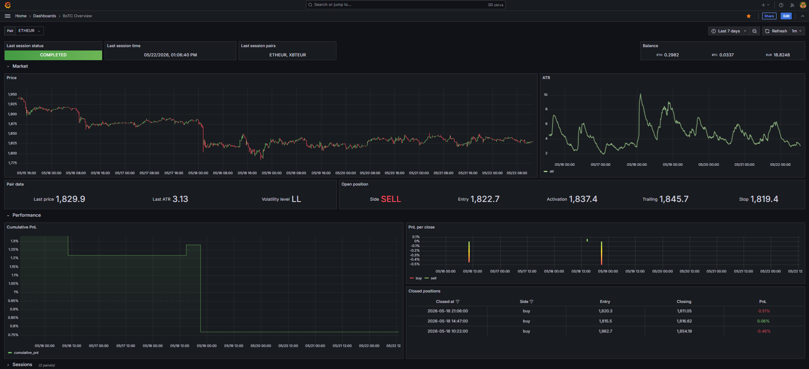
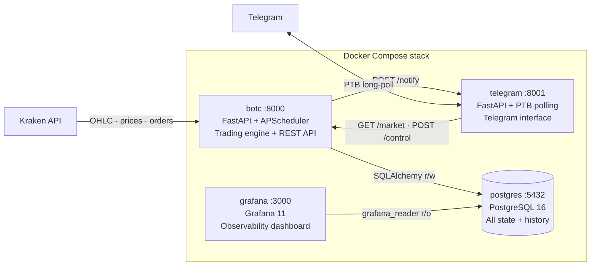
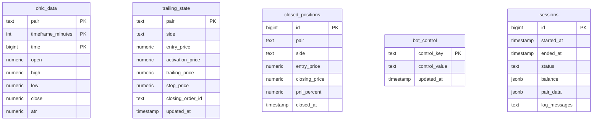

# BoTCoin — Autonomous Trading Bot Backend

[](https://github.com/jAjiz/BoTC/actions/workflows/ci.yml)
[](https://github.com/jAjiz/BoTC/actions/workflows/ci.yml)
[](https://www.python.org/downloads/release/python-3120/)

BoTCoin is a production-grade backend service built to demonstrate modern Python engineering practices. It runs an ATR-based trailing-stop strategy against Kraken's EUR pairs, persists all state in PostgreSQL, exposes a REST control surface via FastAPI, and ships a Grafana observability layer. The entire stack starts with a single `docker compose up`.



---

## Architecture


```mermaid
graph LR
    subgraph stack["Docker Compose stack"]
        direction TB
        botc["botc :8000\nFastAPI + APScheduler\nTrading engine + REST API"]
        telegram["telegram :8001\nFastAPI + PTB polling\nTelegram interface"]
        postgres[("postgres :5432\nPostgreSQL 16\nAll state + history")]
        grafana["grafana :3000\nGrafana 11\nObservability dashboard"]
    end

    kraken["Kraken API"]
    tg["Telegram"]

    kraken -->|"OHLC · prices · orders"| botc
    botc -->|"SQLAlchemy r/w"| postgres
    grafana -->|"grafana_reader r/o"| postgres
    telegram -->|"GET /market · POST /control"| botc
    botc -->|"POST /notify"| telegram
    tg <-->|"PTB long-poll"| telegram
```

Two application containers share one network. `botc` is the sole writer to every table. `telegram` is a thin API client — it reads and controls the bot exclusively through `botc`'s REST endpoints. Grafana reads the same database through a least-privilege `grafana_reader` role created by an Alembic migration.

---

## Quick start

```bash
cp .env.example .env   # fill in required values — see docs/configuration.md
docker compose up -d --build
```

| Service | URL |
|---|---|
| Trading API (Swagger UI) | http://localhost:8000/docs |
| Grafana dashboard | http://localhost:3000 |

```bash
docker compose logs -f botc        # watch trading sessions
docker compose down                # stop all services
```

---

## Key engineering decisions

Each decision links to its execution plan — the plan files are the architectural record for this project.

| Phase | Decision | Plan |
|---|---|---|
| 1 – Docker | Single image, multi-service Compose; no host Python required | — |
| 2 – APScheduler | `AsyncIOScheduler` in the FastAPI `lifespan`; `max_instances=1` prevents overlapping ticks | — |
| 3 – Testing | Two-tier pytest (unit + integration) runs entirely inside Docker for production parity | — |
| 4 – PostgreSQL | Synchronous SQLAlchemy under async FastAPI; module-level DAL instead of a repository class | — |
| 5 – FastAPI | `botc` and `telegram` split into two services so Telegram's long-poll lifecycle cannot stall the trading loop | [plan/phase-5-fastapi.md](plan/phase-5-fastapi.md) |
| 6 – ruff | Single tool for lint + format + import sorting; `pyproject.toml` as the single config source | [plan/phase-6-code-quality.md](plan/phase-6-code-quality.md) |
| 7 – CI/CD | GHCR image-based deploy; VPS holds only `.env` + two compose files, no source clone | [plan/phase-7-cicd.md](plan/phase-7-cicd.md) |
| 8 – Grafana | Per-session `sessions` table + filesystem-provisioned dashboard; SQL-native, no Loki / Prometheus | [plan/phase-8-grafana.md](plan/phase-8-grafana.md) |

Full design rationale is in [CLAUDE.md](CLAUDE.md) under **Design choices**.

---

## Data model

Five PostgreSQL tables managed by a single Alembic migration chain (`scripts/migrations/versions/`):


```mermaid
erDiagram
    ohlc_data {
        text pair PK
        int timeframe_minutes PK
        bigint time PK
        numeric open
        numeric high
        numeric low
        numeric close
        numeric atr
    }

    trailing_state {
        text pair PK
        text side
        numeric entry_price
        numeric activation_price
        numeric trailing_price
        numeric stop_price
        text closing_order_id
        timestamp updated_at
    }

    closed_positions {
        bigint id PK
        text pair
        text side
        numeric entry_price
        numeric closing_price
        numeric pnl_percent
        timestamp closed_at
    }

    bot_control {
        text control_key PK
        text control_value
        timestamp updated_at
    }

    sessions {
        bigint id PK
        timestamp started_at
        timestamp ended_at
        text status
        jsonb balance
        jsonb pair_data
        text log_messages
    }
```

**Data flow for a completed trade:**

```
Kraken API
  → fetch_ohlc_data()  →  ohlc_data  (upsert, every session)
  → get_balance() + get_last_prices()  →  core/runtime  (in-memory only)

create_position()
  →  trailing_state  (INSERT: side, entry, activation_price)

tick_position() × N sessions
  →  trailing_state  (UPDATE: trailing_price, stop_price)

close_position()
  →  trailing_state  (UPDATE: closing_order_id, approximate closing_price)

is_closing_complete()  — Kraken QueryOrders confirms fill
  →  closed_positions  (INSERT: real fill price, pnl_percent)
  →  trailing_state  (DELETE)
```

---

## Roadmap & future work

See [ROADMAP.md](ROADMAP.md) for the full phased plan.

The next planned phase:

**Phase 10 – Trading Tools Integration**: fold `backtest.py` and `optimize_params.py` into the API as JSON endpoints (`POST /backtest`, async `POST /optimizer/jobs`) with Postgres-persisted job state, Numba JIT on the simulator core, and Optuna TPE replacing the exhaustive parameter grid. See [ROADMAP.md](ROADMAP.md#phase-10--trading-tools-integration-backtest--optimizer) for scope.

---

## Documentation

| Document | Contents |
|---|---|
| [docs/configuration.md](docs/configuration.md) | Every `.env` variable, its default, and its effect |
| [docs/trading-strategy.md](docs/trading-strategy.md) | ATR classification, K_STOP calibration, position lifecycle |
| [docs/operations.md](docs/operations.md) | Local dev, production deploy, rollback, monitoring, troubleshooting |
| [CHANGELOG.md](CHANGELOG.md) | V2 phase-by-phase change history |
| [ROADMAP.md](ROADMAP.md) | Full improvement areas and phased plan |

---

## Contributing

Issues and pull requests are welcome. See [CLAUDE.md](CLAUDE.md) for coding conventions, design decisions, and testing requirements.

**Author**: [jAjiz](https://github.com/jAjiz)

---

*Cryptocurrency trading involves substantial financial risk. This software is not financial advice. Use at your own risk.*
