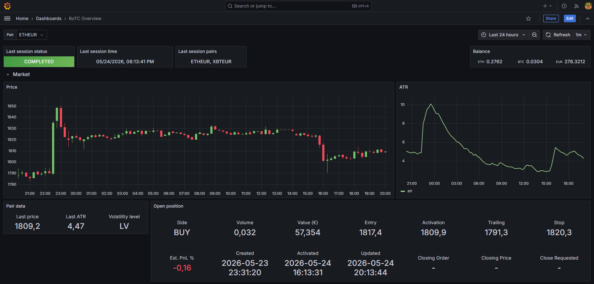
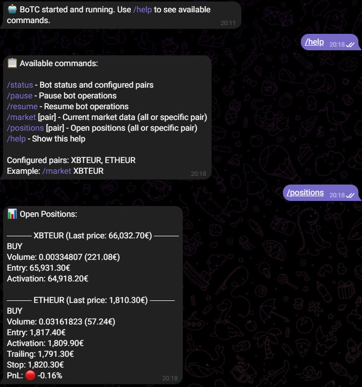
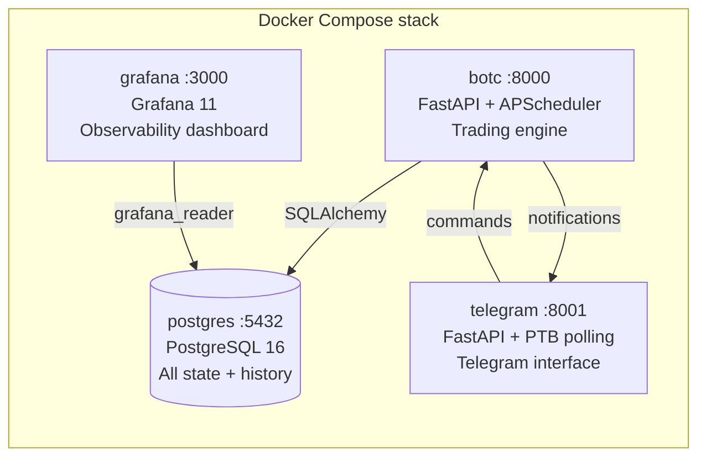
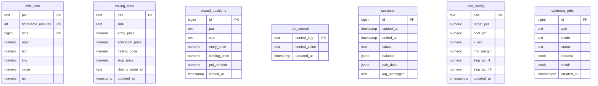

# BoTCoin — Autonomous Trading Bot Backend

> **Status: closed — September 2026.** The bot no longer runs and the production
> stack is decommissioned. Twenty-four strategy avenues were measured and none
> beat holding the base asset out of sample, so live trading was stopped. The
> repository is kept as it was on the last day it ran, because the engineering is
> the point and **the negative result is part of it** — see [The result](#the-result).

[](https://github.com/jAjiz/BoTCoin/actions/workflows/ci.yml)
[](https://github.com/jAjiz/BoTCoin/actions/workflows/ci.yml)
[](https://www.python.org/downloads/release/python-3120/)

BoTCoin is a production-grade backend service built using modern Python engineering practices. It ran an ATR-based trailing-stop strategy against Kraken's EUR pairs, persisted all state in PostgreSQL, exposed a REST control surface via FastAPI, shipped a Grafana observability layer, and was operated through a Telegram bot controller. The whole stack still starts with a single `docker compose up`, against your own credentials.

<table>
  <tr>
    <td></td>
    <td></td>
  </tr>
</table>

---

## The result

Most trading bots in a portfolio show a backtest and claim an edge. This one asked
whether the edge exists, measured it, and published the answer.

The question was not "is it profitable". In a rising market anything long is
profitable. The question was whether the bot **accumulates more of the base asset
than holding it**, so holding scores 0 % by construction and is the bar every
figure is measured against. The answer is **no**, for every parameterisation, gate
and objective tested.

- **In-sample selection has no forward value.** Median percentile 50 of the
  forward distribution, over nine decision dates enumerating the whole
  105-configuration space.
- **The market period decides, not the parameters.** In one 60-day period 0 of 105
  configurations beat holding; in the next, 100 of 105 do.
- **Over three continuous years it loses 78 % of the base asset in four
  operations.** 2023-2025, while holding returned +384 % in euros. 0 of 105 beat
  holding.
- **No gate fixes it, including one fitted with hindsight.** Hill-climbing 366 free
  per-day booleans against the bot's own 2024 result reaches +113.1 %. The same
  climb on a **shuffled, memoryless** year reaches +173.5 %. In four cells of four,
  noise admits a better oracle gate than the real market does.

The full study — 24 avenues, the decisions taken, the measurement traps and the
surviving tools — is in
[`docs/specs/optimizer-validation-design.md`](docs/specs/optimizer-validation-design.md).
Read "Measurement traps" first if you read nothing else.

---

## Architecture


```mermaid
graph BT
    subgraph stack["Docker Compose stack"]
        direction TB
        botc["botc :8000\nFastAPI + APScheduler\nTrading engine"]
        telegram["telegram :8001\nFastAPI + PTB polling\nTelegram interface"]
        postgres[("postgres :5432\nPostgreSQL 16\nAll state + history")]
        grafana["grafana :3000\nGrafana 11\nObservability dashboard"]
    end

    botc -->|"SQLAlchemy"| postgres
    grafana -->|"grafana_reader"| postgres
    telegram -->|"commands"| botc
    botc -->|"notifications"| telegram
```

Two application containers share one network. `botc` is the sole writer to every table. `telegram` is a thin API client — it reads and controls the bot exclusively through `botc`'s REST endpoints. Grafana reads the same database through a least-privilege `grafana_reader` role created by an Alembic migration.

---

## Quick start

```bash
cp .env.example .env   # fill in required values — see docs/configuration.md
docker compose up -d --build
```

| Service | URL |
|---|---|
| Trading API (Swagger UI) | http://localhost:8000/docs |
| Grafana dashboard | http://localhost:3000 |

```bash
docker compose logs -f botc        # watch trading sessions
docker compose down                # stop all services
```

---

## Key engineering decisions

Each decision links to its phase in the roadmap — execution plans and design rationale are linked from there.

| Technology | Why it was chosen | Reference |
|---|---|---|
| Docker | Ships the whole four-service stack as one image so it runs identically on a laptop and the VPS — no host Python or dependency drift. | [Roadmap](docs/v2/ROADMAP.md#phase-1--infrastructure-first-docker-completed) |
| APScheduler | The bot works by running a trading session on a fixed interval, over and over. A lightweight in-process scheduler is the simplest, cleanest way to do that — no separate worker or task queue to run and maintain. | [Roadmap](docs/v2/ROADMAP.md#phase-2--managed-execution-apscheduler-completed) |
| pytest | Fixtures + monkeypatch fit the mock-the-exchange testing style; the unit/integration split runs inside Docker so tests hit the same image and Postgres as production. | [Roadmap](docs/v2/ROADMAP.md#phase-3--testing-strategy-completed) |
| PostgreSQL | One reliable store for all trading state and history, with transactions to keep that state consistent. Sync SQLAlchemy because the loop ticks every few seconds — no concurrent load to justify async. | [Roadmap](docs/v2/ROADMAP.md#phase-4--professional-persistence-postgresql-completed) |
| FastAPI | Async REST layer with built-in validation and OpenAPI docs; `botc` and `telegram` are split so Telegram's blocking long-poll can never stall the trading loop. | [Roadmap](docs/v2/ROADMAP.md#phase-5--rest-api-layer-fastapi-completed) |
| ruff | One Rust-fast tool replaces flake8 + black + isort for lint, format, and import sorting, configured solely in `pyproject.toml`. | [Roadmap](docs/v2/ROADMAP.md#phase-6--code-quality-linting--type-safety-completed) |
| GitHub Actions + GHCR | Build the image once in CI and deploy by tag; the VPS pulls from GHCR and holds only `.env` + compose files — no source clone or on-host build. | [Roadmap](docs/v2/ROADMAP.md#phase-7--cicd-pipeline-completed) |
| Grafana | A ready-made observability dashboard that reads the bot's Postgres tables directly with plain SQL, so market data, positions, and performance are visible without building a custom UI. | [Roadmap](docs/v2/ROADMAP.md#phase-8--observability-grafana-dashboard-completed) |
| `ProcessPoolExecutor` | The optimizer enumerates a 105-candidate space and evaluates every point exactly once, so an identical request returns an identical ranking. The work is CPU-bound, so it runs in a spawned process pool behind an API endpoint with its jobs saved in Postgres. Optuna was removed on the way: with no sampler, there is nothing for seeds to disagree about. | [Spec](docs/specs/optimizer-simplification-design.md) |

Full design rationale is in [CLAUDE.md](CLAUDE.md) under **Design choices**.

---

## Data model

Seven PostgreSQL tables managed by a single Alembic migration chain (`scripts/migrations/versions/`):


```mermaid
erDiagram
    ohlc_data {
        text pair PK
        int timeframe_minutes PK
        bigint time PK
        numeric open
        numeric high
        numeric low
        numeric close
        numeric atr
    }

    trailing_state {
        text pair PK
        text side
        numeric entry_price
        numeric activation_price
        numeric trailing_price
        numeric stop_price
        text closing_order_id
        timestamp updated_at
    }

    closed_positions {
        bigint id PK
        text pair
        text side
        numeric entry_price
        numeric closing_price
        numeric pnl_percent
        timestamp closed_at
    }

    bot_control {
        text control_key PK
        text control_value
        timestamp updated_at
    }

    sessions {
        bigint id PK
        timestamp started_at
        timestamp ended_at
        text status
        jsonb balance
        jsonb pair_data
        text log_messages
    }

    pair_config {
        text pair PK
        numeric target_pct
        numeric hodl_pct
        numeric k_act
        numeric min_margin
        numeric stop_pct_ll
        numeric stop_pct_hh
        timestamptz updated_at
    }

    optimizer_jobs {
        bigint id PK
        text pair
        text mode
        text status
        jsonb request
        jsonb result
        timestamptz created_at
    }
```

**Data flow for a completed trade:**

```
Kraken API
  → fetch_ohlc_data()  →  ohlc_data  (upsert, every session)
  → get_balance() + get_last_prices()  →  core/runtime  (in-memory only)

create_position()
  →  trailing_state  (INSERT: side, entry, activation_price)

tick_position() × N sessions
  →  trailing_state  (UPDATE: trailing_price, stop_price)

close_position()
  →  trailing_state  (UPDATE: closing_order_id, approximate closing_price)

manage_close_position() → finalize_close()  — Kraken confirms the fill
  →  closed_positions  (INSERT: real fill price, pnl_percent)
  →  trailing_state  (DELETE)
```

---

## Project status

BoTCoin reached its goal of a production-grade backend service, and that milestone is closed — see the archived [V2 roadmap](docs/v2/ROADMAP.md) for the full delivered scope.

The strategy line is closed too, and with it the project. The backlog at [docs/BACKLOG.md](docs/BACKLOG.md) records what shipped, and why every remaining card was closed rather than built. Nothing is planned.

---

## Documentation

| Document | Contents |
|---|---|
| [docs/configuration.md](docs/configuration.md) | Every `.env` variable, its default, and its effect |
| [docs/trading-strategy.md](docs/trading-strategy.md) | ATR classification, K_STOP calibration, position lifecycle |
| [docs/operations.md](docs/operations.md) | Local dev, production deploy, rollback, monitoring, troubleshooting |
| [docs/specs/optimizer-validation-design.md](docs/specs/optimizer-validation-design.md) | **The study** — 24 avenues, the measurement traps, and the surviving tools |
| [docs/BACKLOG.md](docs/BACKLOG.md) | Feature backlog — stock of planned, shipped, and deferred features |
| [docs/v2/ROADMAP.md](docs/v2/ROADMAP.md) | Archived V2 roadmap (closed) and phase plans |

---

## Contributing

The repository is closed and takes no further changes. [CLAUDE.md](CLAUDE.md) documents the coding conventions, the design decisions and the testing requirements it was built under.

---

*Cryptocurrency trading involves substantial financial risk. This software is not financial advice. Use at your own risk.*
