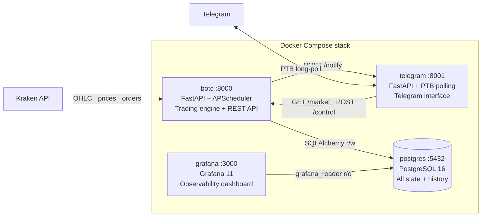
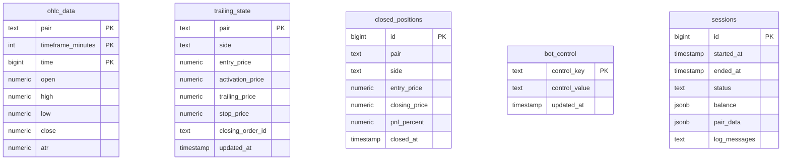

# Phase 9 – Project Documentation & Portfolio Framing

## Context

- Branch: `feature/phase-9-project-documentation` (already created)
- Prior phases delivered: Docker (Phase 1), APScheduler (Phase 2), API efficiency (Phase 2.1), pytest two-tier suite (Phase 3), PostgreSQL via SQLAlchemy + Alembic (Phase 4), FastAPI + Telegram split (Phase 5), ruff lint + format + type annotations (Phase 6), unified CI/CD with GHCR image-based deploy (Phase 7), Grafana dashboard with per-session telemetry (Phase 8).
- Relevant files to read before starting:
  - `ROADMAP.md` — Phase 9 scope (authoritative)
  - `README.md` — the primary rewrite target; read front-to-back to inventory every section and decide what to keep, trim, or move to `docs/`
  - `.env.example` — the authoritative source for `docs/configuration.md`; extract every variable from here, not from the README
  - `docker-compose.yml` — service names and port bindings for the architecture diagram
  - `.github/workflows/ci.yml` — job names and badge URL for the README hero section
  - `core/database.py` — ORM model fields for the ERD in the data model section (five models: `OHLCData`, `ClosedPosition`, `TrailingState`, `BotControl`, `SessionRecord`)
  - `plan/phase-5-fastapi.md` through `plan/phase-8-grafana.md` — the planning artifacts that become portfolio-linked from the key decisions table in the README
- Architectural decisions:
  - **README is the engineering cover letter.** It leads with architecture and decisions; deep configuration and trading theory move to `docs/`. A reader can grasp the project's scope in under one minute without scrolling past configuration tables.
  - **`docs/` is the reference layer.** Each file is the authoritative, operator-facing reference for one concern (configuration, strategy, operations). Depth is fine; the README links to it.
  - **`CHANGELOG.md` starts at the V2 milestone.** V1 history is not retroactively documented. Each entry maps to one completed phase, written as `Added` / `Changed` / `Removed` bullets, not prose.
  - **The project is consistently framed as a backend engineering project.** Introductions describe the engineering stack; crypto market data is domain context, not the headline.
  - **Coverage badge is static.** The 80 % gate is enforced by `pyproject.toml` and visible in every CI run; a static `≥80 %` shield documents the gate without requiring a third-party coverage service.

## Target outcome

After Phase 9, the repository presents the following reading paths:

```
README.md                  ← 6-section engineering cover letter (≤ 300 lines)
│
├── docs/
│   ├── configuration.md   ← complete env var reference
│   ├── trading-strategy.md← algorithm, classification, calibration
│   └── operations.md      ← dev setup, deploy, rollback, monitoring
│
├── CHANGELOG.md           ← V2 phase-by-phase change history
│
└── plan/
    ├── phase-5-fastapi.md
    ├── phase-6-code-quality.md
    ├── phase-7-cicd.md
    ├── phase-8-grafana.md
    └── phase-9-project-documentation.md  ← this document
```

A recruiter scanning for under a minute sees: badges, a problem statement, a container architecture diagram (Mermaid), and eight engineering decisions linked to planning artifacts. A developer wanting to run the project finds a three-command Quick Start. An operator configuring a new pair opens `docs/configuration.md` directly.

---

## Step 0 — Prerequisites

### 0.1 Create the `docs/` directory

`docs/` does not exist yet. Create it now:

```bash
mkdir docs
```

No commit for this sub-step — the directory is committed implicitly when the first file is added in Step 1.

### 0.2 Update `CLAUDE.md`

Three concrete changes are needed. Apply all three, then commit.

**Change 1 — Fix the service count in "What this project is"**

Replace:
```
Two Docker services: `botc` (trading engine + FastAPI on :8000) and `telegram` (Telegram bot + notify webhook on :8001).
```
With:
```
Four Docker services: `botc` (trading engine + FastAPI on :8000), `telegram` (Telegram bot + notify webhook on :8001), `postgres` (PostgreSQL, all state), and `grafana` (observability dashboard on :3000).
```

**Change 2 — Fix the ORM model count and add `SessionRecord` in the Database section**

Replace:
```
Four ORM models: `OHLCData`, `TrailingState`, `ClosedPosition`, `BotControl`. Direct SQLAlchemy (no async). All DAL functions are at module level (not a class). Migrations live in `scripts/migrations/versions/` managed by Alembic (`alembic.ini` points there).

`TrailingState` captures the full active position dict. Fields are optional during the open phase (`trailing_price`, `stop_price`, `closing_order_id`, etc.) and populated progressively as the position advances.

`BotControl` is a generic key/value table (`control_key` → `control_value`) accessed via `get_control_value` / `set_control_value`. Intended for runtime flags that should survive restarts and be toggled without redeploy; **currently has no production callers** — the table and DAL exist but no feature uses it yet.
```
With:
```
Five ORM models: `OHLCData`, `TrailingState`, `ClosedPosition`, `BotControl`, `SessionRecord`. Direct SQLAlchemy (no async). All DAL functions are at module level (not a class). Migrations live in `scripts/migrations/versions/` managed by Alembic (`alembic.ini` points there).

`TrailingState` captures the full active position dict. Fields are optional during the open phase (`trailing_price`, `stop_price`, `closing_order_id`, etc.) and populated progressively as the position advances.

`BotControl` is a generic key/value table (`control_key` → `control_value`) accessed via `get_control_value` / `set_control_value`. Intended for runtime flags that should survive restarts and be toggled without redeploy; **currently has no production callers** — the table and DAL exist but no feature uses it yet.

`SessionRecord` is written once at the start of every `trading_session()` call (status `running`) and updated in the `finally` block with the final status, balance snapshot, per-pair market data, and captured log lines. It is the primary data source for the Grafana Sessions row.
```

**Change 3 — Append three new entries to the Design choices section**

After the last existing bullet (`**No global stop-loss.**…`), add:

```
- **`telegram` runs as a separate service, not inside `botc`.** PTB's `Application.run_polling()` blocks its thread indefinitely. Co-locating it with the scheduler would risk a dropped Telegram connection stalling the trading loop. A separate service means the trading engine is entirely unaffected by Telegram's availability.
- **`_SessionLogCollector` attaches to the root logger rather than threading a context object.** The alternative — passing a log buffer through the call graph (`trading_session` → `positions_manager` → `market_analyzer` → …) — would require modifying every function signature. The root-logger approach captures records from every module called during the session with zero changes to any call site.
- **`sessions.log_messages` is `Text` (JSON string), not `JSONB`.** `balance` and `pair_data` use `JSONB` because Grafana queries them with SQL operators (`->>`, `jsonb_array_elements`). `log_messages` is always fetched as a whole array, never queried by individual entry — `Text` avoids `JSONB` parse overhead with no query trade-off at this access pattern.
```

**Commit:** `docs(claude): fix service count, add SessionRecord, add Phase 5–8 design choices`

---

## Step 1 — `CHANGELOG.md`

Introduce the project changelog at the repository root. Format follows [Keep a Changelog](https://keepachangelog.com/en/1.0.0/). Each section corresponds to one completed phase. Bullets are past tense; no prose.

Create `CHANGELOG.md`:

```markdown
# Changelog

All notable changes to BoTCoin V2 are documented in this file.  
V1 history is not retroactively documented. This changelog tracks changes from the V2 milestone onwards.

Format: [Keep a Changelog](https://keepachangelog.com/en/1.0.0/).

---

## [Unreleased]

---

## [2.8.0] – Phase 8: Observability — Grafana Dashboard

### Added
- `sessions` table (Alembic migration `20260512_01`) capturing start/end timestamps, completion status, balance snapshot, per-pair market data, and log lines per scheduler tick
- `grafana_reader` Postgres role with read-only grants on all five application tables
- Grafana 11 service in `docker-compose.yml`, provisioned entirely from repository-managed YAML and JSON files under `services/grafana/`
- "BoTC Overview" pre-built dashboard with four rows: market metrics, performance metrics, system state, and session history
- `_SessionLogCollector` handler in `core/scheduler.py` that captures log records for `sessions.log_messages`

### Changed
- `trading_session()` opens a `sessions` row at the top and finalises it (with status + captured data) in a `finally` block regardless of session outcome

---

## [2.7.0] – Phase 7: CI/CD Pipeline

### Added
- `docker-compose.prod.yml` — production override replacing `build:` with `image: ghcr.io/jajiz/botc:${IMAGE_TAG:-main}` for `botc` and `telegram`
- `.github/workflows/ci.yml` — unified five-job pipeline: `Lint (ruff)`, `Unit tests`, `Integration tests`, `Build and push image`, `Deploy to VPS`; lint and tests gate the build; build gates the deploy

### Removed
- `.github/workflows/deploy.yml` — superseded by `ci.yml`

---

## [2.6.0] – Phase 6: Code Quality — Linting & Type Safety

### Added
- `pyproject.toml` as the single source of truth for `ruff`, `pytest`, and coverage configuration
- `ruff` pinned in `requirements-dev.txt`
- Full argument and return-type annotations on every public function across `core/`, `exchange/`, `trading/`, `services/telegram/`, `api/`, and `scripts/`
- `_safe_call` helper in `exchange/kraken.py` collapsing the repeated query/error-log/return-None pattern
- `_to_decimal_required` helper in `core/database.py` for non-nullable Decimal conversions

### Changed
- Logging convention normalised: `import logging as stdlib_logging` alongside `import core.logging as logging` wherever both are needed
- All `Optional[X]` annotations replaced with `X | None`; all `List[X]` with `list[X]`
- Inline `TODO` comments replaced with GitHub issue links

### Removed
- `pytest.ini` — configuration moved to `pyproject.toml`
- `.coveragerc` — configuration moved to `pyproject.toml`

---

## [2.5.0] – Phase 5: REST API Layer — FastAPI

### Added
- `api/` package: `GET /market`, `GET /positions`, `GET /balance`, `GET /status`, `POST /control/pause`, `POST /control/resume`
- `api/schemas.py` with Pydantic v2 response models
- `AsyncIOScheduler` started from the FastAPI `lifespan` hook with a dedicated `ThreadPoolExecutor`
- `services/telegram/` as an independent FastAPI service with PTB polling, `/notify` endpoint, and `httpx`-backed command handlers
- `API_SECRET_TOKEN` protecting all REST endpoints and the `/notify` webhook
- `botc` (`:8000`) and `telegram` (`:8001`) as two separate services in `docker-compose.yml`

### Changed
- `BlockingScheduler` replaced with `AsyncIOScheduler`
- Telegram command handlers refactored to delegate all reads and commands to the `botc` API via `httpx`

---

## [2.4.0] – Phase 4: Professional Persistence — PostgreSQL

### Added
- `core/database.py` — DAL with four ORM models (`OHLCData`, `ClosedPosition`, `TrailingState`, `BotControl`) and module-level functions
- Alembic migration `20260414_01_phase4_initial_schema.py` creating all four tables with appropriate indexes
- `scripts/load_legacy_data.py` — one-time migration script importing existing CSV/JSON data into PostgreSQL
- Full `postgres` service in `docker-compose.yml` with health check and named volume

### Removed
- Flat-file persistence (JSON for state, CSV for OHLC history) from the production path

---

## [2.3.0] – Phase 3: Testing Strategy

### Added
- `tests/unit/` — pure-logic test suite for `core/`, `trading/`, and `exchange/` (no network calls)
- `tests/integration/` — optional live-connectivity tests gated by `RUN_DB_INTEGRATION` and `RUN_KRAKEN_INTEGRATION`
- `docker-compose.test.yml` with a `test` service for running the suite inside Docker
- `pytest.ini` with markers (`unit`, `integration`) and an 80 % coverage gate

---

## [2.2.1] – Phase 2.1: API Efficiency

### Added
- Module-level rate limiter in `exchange/kraken.py` enforcing 1-second minimum between public API calls
- `TELEGRAM_ENABLED` flag in `.env` to disable Telegram initialisation without touching call sites

### Changed
- ATR calculation uses the penultimate candle (`iloc[-2]`) instead of the latest to avoid incomplete-candle bias

### Removed
- Blanket `time.sleep(1)` calls from the main loop and error handlers

---

## [2.2.0] – Phase 2: Managed Execution — APScheduler

### Added
- `apscheduler` as a runtime dependency
- `IntervalTrigger` job replacing the `while True` loop, with `max_instances=1`
- `SIGTERM`/`SIGINT` handlers calling `scheduler.shutdown(wait=True)` for graceful shutdown
- `call_with_retry` for read-only API calls (balance, prices, ATR)

### Removed
- Unmanaged `while True` loop from `main.py`

---

## [2.1.0] – Phase 1: Infrastructure — Docker

### Added
- `Dockerfile` using a Python 3.12 slim base image
- `docker-compose.yml` with `botc` and `postgres` service stubs
- `.dockerignore` excluding `.env`, `__pycache__`, `data/`, and test artefacts
- `.env.example` documenting all supported environment variables

---

## [2.0.0] – Phase 0: AI-Assisted Development Environment

### Added
- `.github/agents/`, `.github/instructions/`, `.github/skills/` infrastructure
- Awesome-Copilot agents, instructions, and skills for architectural consistency and accelerated delivery
```

**Commit:** `docs(changelog): add CHANGELOG.md with V2 phase history`

---

## Step 2 — `docs/configuration.md`

Extract all environment-variable documentation from `README.md` into a dedicated reference. The source of truth for this file is `.env.example` — every variable listed there must have a row in a table. Descriptions explain the *effect* on the system.

Create `docs/configuration.md`:

```markdown
# Configuration Reference

All configuration is loaded from `.env` at startup. Copy `.env.example` to `.env` and fill in the required values before running `docker compose up`.

---

## Service URLs

Set automatically by Docker Compose via `docker-compose.yml`. Override only when running services outside of Docker.

| Variable | Default | Effect |
|---|---|---|
| `API_BASE_URL` | `http://botc:8000` | Base URL the `telegram` service uses to reach the `botc` API |
| `TELEGRAM_SERVICE_URL` | `http://telegram:8001` | URL `core/logging.py` posts `to_telegram=True` messages to |

---

## Kraken API

| Variable | Required | Default | Effect |
|---|---|---|---|
| `KRAKEN_API_KEY` | yes | — | API key from your Kraken account (read only + trade permissions) |
| `KRAKEN_API_SECRET` | yes | — | Matching API secret; never commit `.env` to version control |

---

## Telegram

| Variable | Required | Default | Effect |
|---|---|---|---|
| `TELEGRAM_TOKEN` | yes | — | Bot token from @BotFather |
| `TELEGRAM_USER_ID` | yes | — | Your numeric Telegram user ID; commands from any other user are silently ignored |
| `TELEGRAM_ENABLED` | no | `true` | Set to `false` to start the stack without Telegram (useful in dev; `telegram` service still starts but sends no messages) |
| `TELEGRAM_POLL_INTERVAL` | no | `10` | Seconds between PTB long-poll requests |

---

## API authentication

| Variable | Required | Default | Effect |
|---|---|---|---|
| `API_SECRET_TOKEN` | yes* | — | Bearer token protecting all `botc` REST endpoints and the `telegram` `/notify` webhook. Both services read this from the same `.env`. If unset, the app refuses to start unless `ALLOW_NO_AUTH=true` is also set |
| `ALLOW_NO_AUTH` | no | `false` | Set to `true` to start without authentication (development only; never use in production) |

---

## Bot behaviour

| Variable | Required | Default | Effect |
|---|---|---|---|
| `PAIRS` | yes | — | Comma-separated list of Kraken pair identifiers, e.g. `XBTEUR,ETHEUR` |
| `SLEEPING_INTERVAL` | no | `60` | Seconds between trading sessions |
| `PARAM_SESSIONS` | no | `720` | Sessions before recalculating K_STOP parameters (~12 h at 60 s intervals) |
| `CANDLE_TIMEFRAME` | no | `15` | OHLC candle size in minutes |
| `ATR_PERIOD` | no | `14` | Number of candles in the ATR rolling window |
| `ATR_DESV_LIMIT` | no | `0.2` | Fractional ATR drift that triggers position recalibration (0.2 = 20 %) |
| `MIN_VALUE` | no | `10` | Minimum operation value in EUR; positions below this threshold are skipped |
| `MINIMUM_CHANGE_PCT` | no | `0.02` | Minimum relative price change for a local extremum to count as a pivot (2 %) |

---

## Per-pair parameters

For each pair listed in `PAIRS`, define the following variables by replacing `PAIR` with the pair identifier (e.g. `XBTEUR`).

| Pattern | Required | Default | Effect |
|---|---|---|---|
| `PAIR_TARGET_PCT` | yes | — | Target portfolio allocation for this asset as a percentage of total portfolio value |
| `PAIR_HODL_PCT` | yes | — | Minimum hold threshold; the bot does not sell below this percentage |
| `PAIR_K_ACT` | no | — | ATR multiplier for activation price distance. If omitted, `K_STOP × ATR + MIN_MARGIN × entry_price` is used instead |
| `PAIR_SELL_K_ACT` / `PAIR_BUY_K_ACT` | no | — | Per-side overrides for `K_ACT` |
| `PAIR_MIN_MARGIN` | no | — | Minimum profit margin from entry price as a fraction (e.g. `0.009` = 0.9 %). Used only when `K_ACT` is not set |
| `PAIR_SELL_MIN_MARGIN` / `PAIR_BUY_MIN_MARGIN` | no | — | Per-side overrides for `MIN_MARGIN` |
| `PAIR_STOP_PCT_LL` | yes | — | K_STOP percentile for Very Low Volatility (LL) regime |
| `PAIR_STOP_PCT_LV` | yes | — | K_STOP percentile for Low Volatility (LV) regime |
| `PAIR_STOP_PCT_MV` | yes | — | K_STOP percentile for Medium Volatility (MV) regime |
| `PAIR_STOP_PCT_HV` | yes | — | K_STOP percentile for High Volatility (HV) regime |
| `PAIR_STOP_PCT_HH` | yes | — | K_STOP percentile for Very High Volatility (HH) regime |

See [trading-strategy.md](trading-strategy.md) for how K_STOP percentiles are derived and what values to choose.

---

## PostgreSQL

| Variable | Required | Default | Effect |
|---|---|---|---|
| `POSTGRES_DB` | no | `DBbotc` | Database name |
| `POSTGRES_USER` | no | `botc` | Application user (read/write) |
| `POSTGRES_PASSWORD` | yes | — | Password for `POSTGRES_USER` |
| `POSTGRES_HOST` | no | `postgres` | Hostname (Docker internal DNS; override for external Postgres) |
| `POSTGRES_PORT` | no | `5432` | Port |

---

## Grafana

| Variable | Required | Default | Effect |
|---|---|---|---|
| `GRAFANA_DB_PASSWORD` | yes | — | Password for the `grafana_reader` Postgres role; set during `alembic upgrade head` (migration `20260512_01`) |
| `GF_SECURITY_ADMIN_USER` | no | `admin` | Grafana admin username; read by Grafana on first boot only |
| `GF_SECURITY_ADMIN_PASSWORD` | yes | — | Grafana admin password; stored as bcrypt in the `gf_data` volume after first boot |
```

**Commit:** `docs(configuration): extract env var reference to docs/configuration.md`

---

## Step 3 — `docs/trading-strategy.md`

Create `docs/trading-strategy.md` capturing the algorithm, position lifecycle, volatility classification, and K_STOP calibration. This extracts and deepens the "Architecture & Trading Engine" and "Data Analysis & Volatility Regimes" content from `README.md`.

Create `docs/trading-strategy.md`:

```markdown
# Trading Strategy Reference

BoTCoin implements an ATR-based trailing-stop strategy that adapts stop distances to current market volatility. This document covers: decision logic → position lifecycle → volatility classification → K_STOP calibration.

---

## Decision logic

Every trading session, for each configured pair, the bot:

1. Fetches the current price and computes ATR from stored OHLC data.
2. Classifies the ATR into one of five volatility levels (LL / LV / MV / HV / HH) using pair-specific percentile boundaries.
3. Selects K_STOP for the current level and position side from the calibrated parameter set.
4. If no position is open, creates one with a calculated activation price.
5. If a position is open and pre-activation, monitors the activation price (recalibrating if ATR drifts).
6. If a position is active (trailing), tracks the trailing price and checks whether the stop has been hit.
7. If a closing order was placed and is now filled on Kraken, records the real fill price and computes PnL.

### Balance-majority logic

Portfolio composition determines whether a new position is a BUY or SELL:

- If the asset's current value **exceeds** `PAIR_TARGET_PCT` → prioritise SELL (reduce the overweight).
- If the asset's current value **is below** `PAIR_TARGET_PCT` → prioritise BUY (build toward the target).

The position value is the difference between the target allocation and the current allocation, capped at available EUR (buys) or available asset (sells). Positions whose computed value is below `MIN_VALUE` are skipped.

---

## Position lifecycle

### Activation price

The activation price is the trigger that converts a waiting position into an active trailing stop. Two calculation strategies are supported:

**K_ACT strategy** (when `PAIR_K_ACT` is set):
```
activation_distance = K_ACT × ATR
SELL: activation_price = entry_price + activation_distance
BUY:  activation_price = entry_price − activation_distance
```

**MIN_MARGIN strategy** (when `PAIR_K_ACT` is not set):
```
activation_distance = K_STOP × ATR + MIN_MARGIN × entry_price
```

`K_ACT` and `MIN_MARGIN` can each be configured per side (`PAIR_SELL_K_ACT`, `PAIR_BUY_K_ACT`, etc.) or as a shared value for both sides.

### Trailing-stop mechanics

Once the market price crosses the activation price:

1. The **trailing price** tracks the best price seen since activation (highest for SELL, lowest for BUY).
2. The **stop price** is recalculated each session: `trailing_price ± K_STOP × ATR`.
3. When the market reverses and crosses the stop price, a limit order is placed at the current market price to close the position.

### Recalibration

If ATR changes by more than `ATR_DESV_LIMIT` (default 20 %) between sessions, both the activation price (pre-activation) and the stop price (post-activation) are recalculated with the new ATR. This prevents the stop from becoming stale in a volatility regime shift.

### Position closure

`close_position` places a limit order and records the approximate `closing_price` (at order placement time). `is_closing_complete` polls the Kraken `QueryOrders` endpoint; when the fill is confirmed, it overwrites `closing_price` with the real fill price and computes `pnl_percent`. PnL is valid only after `is_closing_complete` returns `True`.

---

## Volatility classification

ATR is classified into five levels using percentile boundaries precomputed from each pair's OHLC history:

| Level | ATR range | Description |
|---|---|---|
| LL | < P20 | Very Low Volatility |
| LV | P20–P50 | Low Volatility |
| MV | P50–P80 | Medium Volatility |
| HV | P80–P95 | High Volatility |
| HH | > P95 | Very High Volatility |

`get_volatility_level(pair, atr)` in `trading/parameters_manager.py` performs this classification against the current pair's ATR percentile boundaries.

---

## K_STOP calibration

K_STOP is the trailing-stop coefficient: `stop_price = trailing_price ± K_STOP × ATR`. A larger K_STOP widens the stop (more tolerance for noise before closing); a smaller K_STOP tightens it.

### Structural noise analysis

`analyze_structural_noise` in `trading/market_analyzer.py` identifies pivot points (local minima and maxima) using `scipy.signal.argrelextrema`. For each trend segment it computes:

```
K = max_deviation_from_entry / ATR
```

This K-value represents how far the price moved against the dominant trend (structural noise) relative to ATR — the amount of "noise" to tolerate in a stop.

### K-value percentile selection

`calculate_k_stops` in `trading/parameters_manager.py` groups the per-segment K-values by volatility level and selects the value at the configured percentile (`PAIR_STOP_PCT_<LEVEL>`).

- **Low percentile** (e.g. P25): tight stop — higher closure frequency, smaller per-trade loss.
- **High percentile** (e.g. P95): wide stop — lower closure frequency, larger noise tolerance.

SELL positions use K-values from uptrend segments (drawdown resistance); BUY positions use K-values from downtrend segments (bounce resistance).

### Parameter refresh cadence

Parameters are recalculated every `PARAM_SESSIONS` sessions (default 720 ≈ 12 hours at 60-second intervals). The lookback window spans the entire `ohlc_data` history for the pair.

### Choosing percentile values

No universal answer exists — optimal percentiles depend on the pair's historical volatility and the operator's risk tolerance. Starting recommendations:

- Use the backtest (`trading/backtest.py`) to compare win rate and PnL at different percentile settings over historical data.
- Tighter stops (lower percentile) in high-volatility regimes are often better because ATR already provides distance.
- Looser stops (higher percentile) in low-volatility regimes prevent premature closure from small reversals.

---

## Constraints and invariants

- The trailing stop is the **only** exit mechanism. There is no global stop-loss, no max-loss-per-position, no panic kill switch. Adding one is a strategy change and must be discussed explicitly.
- A position with `closing_order_id` set is **not open** — `tick_position` must not run on it (the scheduler enforces this via step ordering).
- `closing_price` is written twice: first at order placement (approximate) and then at fill confirmation (real). PnL is computed only from the second write.
- `_safe_call` in `exchange/kraken.py` swallows errors and returns `None`. Every caller that does not handle `None` will silently corrupt state.
```

**Commit:** `docs(strategy): extract ATR/K_STOP/trailing-stop docs to docs/trading-strategy.md`

---

## Step 4 — `docs/operations.md`

Create `docs/operations.md` capturing the deployment, testing, monitoring, and troubleshooting procedures from `README.md`. This becomes the authoritative operator reference.

Create `docs/operations.md`:

```markdown
# Operations Guide

---

## Local development

### Prerequisites

- Docker and Docker Compose v2 (no host Python required to run the bot)
- A copy of `.env` filled in from `.env.example` — see [configuration.md](configuration.md)

### Start the full stack

```bash
cp .env.example .env   # fill in required values
docker compose up -d --build
```

| Container | Port | Role |
|---|---|---|
| `botc` | `8000` | FastAPI trading engine + APScheduler |
| `botc-telegram` | `8001` | Telegram bot + `/notify` webhook |
| `botc-postgres` | `5432` | PostgreSQL (all state + history) |
| `botc-grafana` | `3000` | Grafana observability dashboard |

After startup:

- Swagger UI: `http://localhost:8000/docs`
- Grafana: `http://localhost:3000` (anonymous Viewer; use `admin` credentials for edits)

Watch logs: `docker compose logs -f botc`

Stop: `docker compose down`

### Running tests

```bash
# Unit tests (no external services required)
docker compose -f docker-compose.test.yml run --rm test pytest tests/unit

# Full suite (starts an ephemeral Postgres)
docker compose -f docker-compose.test.yml run --rm \
  -e POSTGRES_PASSWORD=botc \
  -e GRAFANA_DB_PASSWORD=local \
  -e RUN_DB_INTEGRATION=true \
  test pytest tests/

# Lint + format check
docker compose -f docker-compose.test.yml run --rm test ruff check .
docker compose -f docker-compose.test.yml run --rm test ruff format --check .

# Auto-fix
docker compose -f docker-compose.test.yml run --rm test ruff check . --fix
docker compose -f docker-compose.test.yml run --rm test ruff format .
```

The 80 % coverage gate is enforced by `pyproject.toml`.

### Analysis scripts

```bash
# Market structure analysis
docker compose run --rm botc python trading/market_analyzer.py PAIR=XBTEUR Volatility=ALL SHOW_EVENTS

# Backtest
docker compose run --rm botc python trading/backtest.py PAIR=XBTEUR FEE_PCT=0.26 START=2025-01-01

# Parameter optimisation
docker compose run --rm botc python trading/optimize_params.py PAIR=XBTEUR MODE=CONSERVATIVE FEE_PCT=0.26
```

---

## Production deployment (VPS)

### CI/CD automated deploy

Every push to `main` that passes lint and tests deploys automatically via `.github/workflows/ci.yml`. The pipeline builds a new image, pushes it to GHCR, and SSHes to the VPS to run `docker compose pull && up -d`.

### First deploy (manual setup)

```bash
# On the VPS — run once
mkdir -p ~/BoTC
# Place .env at ~/BoTC/.env (scp, paste from password manager, etc.)

COMMIT_SHA=$(git rev-parse HEAD)   # or the target commit SHA
curl -fsSL "https://raw.githubusercontent.com/jAjiz/BoTC/${COMMIT_SHA}/docker-compose.yml" \
  -o ~/BoTC/docker-compose.yml
curl -fsSL "https://raw.githubusercontent.com/jAjiz/BoTC/${COMMIT_SHA}/docker-compose.prod.yml" \
  -o ~/BoTC/docker-compose.prod.yml

cd ~/BoTC
docker compose -f docker-compose.yml -f docker-compose.prod.yml pull
docker compose -f docker-compose.yml -f docker-compose.prod.yml up -d
```

Verify: `curl http://localhost:8000/status`

### Manual rollback

Every `push: main` CI run tags the image twice: `:main` (moving) and `:sha-<short>` (immutable). To roll back without reverting the commit on `main`:

```bash
cd ~/BoTC
export IMAGE_TAG=sha-abc1234   # the last known-good SHA
docker compose -f docker-compose.yml -f docker-compose.prod.yml pull
docker compose -f docker-compose.yml -f docker-compose.prod.yml up -d --remove-orphans
```

> **Database note**: rolling back the image does not rewind the database. If the broken release applied an Alembic migration, run `alembic downgrade -1` before rolling back the image.

To return to the latest `main`:

```bash
unset IMAGE_TAG
docker compose -f docker-compose.yml -f docker-compose.prod.yml pull
docker compose -f docker-compose.yml -f docker-compose.prod.yml up -d --remove-orphans
```

---

## Monitoring

### Grafana

The "BoTC Overview" dashboard is available at `http://localhost:3000` (dev) or via SSH tunnel on the VPS (`ssh -L 3000:localhost:3000 <vps>`). It is provisioned automatically on every container start from `services/grafana/dashboards/botc.json`.

To edit the dashboard: make changes in the UI, use `Share → Export → Save to file` (with `Export for sharing externally` unchecked), and replace `services/grafana/dashboards/botc.json`. UI edits to the provisioned dashboard are blocked (`allowUiUpdates: false`); use "Save as" to create an experimental copy.

### Telegram commands

| Command | Description |
|---|---|
| `/help` | List commands and configured pairs |
| `/status` | Operational state (RUNNING / PAUSED) |
| `/pause` | Pause trading (current session completes before halt) |
| `/resume` | Resume trading |
| `/market [pair]` | Current price, ATR, volatility level, and balances |
| `/positions [pair]` | Open positions with P&L estimate |

### Health and status endpoints

| Endpoint | Response |
|---|---|
| `GET /health` | `200 OK` when the service is up |
| `GET /status` | JSON: `paused`, `last_run_at`, per-pair market snapshot |

---

## Troubleshooting

### Bot never starts — database unreachable

`scripts/entrypoint.sh` runs `alembic upgrade head` before the app starts. If it fails, Postgres is likely not ready:

```bash
docker compose ps          # check postgres health status
docker compose logs postgres
```

Wait for the `pg_isready` health check to pass, then: `docker compose restart botc`.

### `GRAFANA_DB_PASSWORD` missing during Alembic migration

Migration `20260512_01` requires `GRAFANA_DB_PASSWORD` in the environment. Ensure it is set in `.env` before running `alembic upgrade head`.

### Session lag / missed ticks

Each session is CPU-bound during ATR calculation. If sessions consistently overrun `SLEEPING_INTERVAL`, inspect `SELECT id, EXTRACT(EPOCH FROM (ended_at - started_at)) AS duration_s FROM sessions ORDER BY id DESC LIMIT 20` to identify the slow sessions. Increasing `SLEEPING_INTERVAL` or trimming old `ohlc_data` rows reduces load.

### Database maintenance — trimming `ohlc_data`

OHLC rows accumulate indefinitely. To keep only the last 120 days per pair:

```sql
DELETE FROM ohlc_data
WHERE time < EXTRACT(EPOCH FROM NOW() - INTERVAL '120 days');
```

### Database maintenance — trimming `sessions`

Session rows also accumulate. No automated retention policy exists yet (noted in ROADMAP as future work). To trim manually:

```sql
DELETE FROM sessions WHERE started_at < NOW() - INTERVAL '90 days';
```

---

## Self-hosting on your own VPS

To run your own instance of BoTCoin using the built-in CI/CD pipeline:

1. **Fork the repository** on GitHub.
2. **Add the following secrets** in your fork under Settings → Secrets and variables → Actions:

| Secret | Value |
|---|---|
| `VM_IP` | Public IP or hostname of your VPS |
| `VM_USER` | SSH user that has Docker access |
| `VM_KEY` | SSH private key for that user (paste the full PEM content) |
| `VM_DEPLOY_PATH` | Absolute path on the VPS for the deploy directory, e.g. `/home/<user>/BoTC` |

3. **Create `.env`** at `$VM_DEPLOY_PATH/.env` on the VPS with your Kraken, Telegram, Postgres, and Grafana credentials (copy from `.env.example` in the repo).
4. **Push to `main`** — the CI/CD pipeline builds the image, runs tests, and deploys automatically. The first push after the VPS is set up completes the initial deploy.

> The VPS needs Docker + Docker Compose v2 installed and the deploy user must be in the `docker` group (`sudo usermod -aG docker $USER`).

**Commit:** `docs(operations): extract deployment and ops procedures to docs/operations.md`

---

## Step 5 — README.md revamp

Replace the entire current `README.md`. The new file is ~250 lines and covers six sections: hero, architecture, quick start, key engineering decisions, data model, and roadmap + documentation links.

Before writing, verify:

1. The CI badge URL in the existing README matches `https://github.com/jAjiz/BoTC/actions/workflows/ci.yml/badge.svg?branch=main` — copy it as-is.
2. Confirm the `services/grafana/` paths by cross-checking the `volumes:` block in `docker-compose.yml`.
3. Read `core/database.py` to confirm the five ORM model names and primary key fields before writing the ERD.

The full new `README.md`:

````markdown
# BoTCoin — Autonomous Trading Bot Backend

[](https://github.com/jAjiz/BoTC/actions/workflows/ci.yml)
[](https://github.com/jAjiz/BoTC/actions/workflows/ci.yml)
[](https://www.python.org/downloads/release/python-3120/)

BoTCoin is a production-grade backend service built to demonstrate modern Python engineering practices. It runs an ATR-based trailing-stop strategy against Kraken's EUR pairs, persists all state in PostgreSQL, exposes a REST control surface via FastAPI, and ships a Grafana observability layer. The entire stack starts with a single `docker compose up`.


---

## Architecture



Two application containers share one network. `botc` is the sole writer to every table. `telegram` is a thin API client — it reads and controls the bot exclusively through `botc`'s REST endpoints. Grafana reads the same database through a least-privilege `grafana_reader` role created by an Alembic migration.

---

## Quick start

```bash
cp .env.example .env   # fill in required values — see docs/configuration.md
docker compose up -d --build
```

| Service | URL |
|---|---|
| Trading API (Swagger UI) | http://localhost:8000/docs |
| Grafana dashboard | http://localhost:3000 |

```bash
docker compose logs -f botc        # watch trading sessions
docker compose down                # stop all services
```

---

## Key engineering decisions

Each decision links to its execution plan — the plan files are the architectural record for this project.

| Phase | Decision | Plan |
|---|---|---|
| 1 – Docker | Single image, multi-service Compose; no host Python required | — |
| 2 – APScheduler | `AsyncIOScheduler` in the FastAPI `lifespan`; `max_instances=1` prevents overlapping ticks | — |
| 3 – Testing | Two-tier pytest (unit + integration) runs entirely inside Docker for production parity | — |
| 4 – PostgreSQL | Synchronous SQLAlchemy under async FastAPI; module-level DAL instead of a repository class | — |
| 5 – FastAPI | `botc` and `telegram` split into two services so Telegram's long-poll lifecycle cannot stall the trading loop | [plan/phase-5-fastapi.md](plan/phase-5-fastapi.md) |
| 6 – ruff | Single tool for lint + format + import sorting; `pyproject.toml` as the single config source | [plan/phase-6-code-quality.md](plan/phase-6-code-quality.md) |
| 7 – CI/CD | GHCR image-based deploy; VPS holds only `.env` + two compose files, no source clone | [plan/phase-7-cicd.md](plan/phase-7-cicd.md) |
| 8 – Grafana | Per-session `sessions` table + filesystem-provisioned dashboard; SQL-native, no Loki / Prometheus | [plan/phase-8-grafana.md](plan/phase-8-grafana.md) |

Full design rationale is in [CLAUDE.md](CLAUDE.md) under **Design choices**.

---

## Data model

Five PostgreSQL tables managed by a single Alembic migration chain (`scripts/migrations/versions/`):



**Data flow for a completed trade:**

```
Kraken API
  → fetch_ohlc_data()  →  ohlc_data  (upsert, every session)
  → get_balance() + get_last_prices()  →  core/runtime  (in-memory only)

create_position()
  →  trailing_state  (INSERT: side, entry, activation_price)

tick_position() × N sessions
  →  trailing_state  (UPDATE: trailing_price, stop_price)

close_position()
  →  trailing_state  (UPDATE: closing_order_id, approximate closing_price)

is_closing_complete()  — Kraken QueryOrders confirms fill
  →  closed_positions  (INSERT: real fill price, pnl_percent)
  →  trailing_state  (DELETE)
```

---

## Roadmap & future work

See [ROADMAP.md](ROADMAP.md) for the full phased plan.

The next planned phase:

**Phase 10 – Trading Tools Integration**: fold `backtest.py` and `optimize_params.py` into the API as JSON endpoints (`POST /backtest`, async `POST /optimizer/jobs`) with Postgres-persisted job state, Numba JIT on the simulator core, and Optuna TPE replacing the exhaustive parameter grid. See [ROADMAP.md](ROADMAP.md#phase-10--trading-tools-integration-backtest--optimizer) for scope.

---

## Documentation

| Document | Contents |
|---|---|
| [docs/configuration.md](docs/configuration.md) | Every `.env` variable, its default, and its effect |
| [docs/trading-strategy.md](docs/trading-strategy.md) | ATR classification, K_STOP calibration, position lifecycle |
| [docs/operations.md](docs/operations.md) | Local dev, production deploy, rollback, monitoring, troubleshooting |
| [CHANGELOG.md](CHANGELOG.md) | V2 phase-by-phase change history |
| [ROADMAP.md](ROADMAP.md) | Full improvement areas and phased plan |

---

## Contributing

Issues and pull requests are welcome. See [CLAUDE.md](CLAUDE.md) for coding conventions, design decisions, and testing requirements.

**Author**: [jAjiz](https://github.com/jAjiz)

---

*Cryptocurrency trading involves substantial financial risk. This software is not financial advice. Use at your own risk.*
````

After writing the new README, verify that the following content is **absent** from `README.md` (it now lives in `docs/`):

- Inline env var tables (e.g. `KRAKEN_API_KEY`, `POSTGRES_PASSWORD`) — now in `docs/configuration.md`
- K_STOP percentile explanation, pivot detection, ATR percentile tables — now in `docs/trading-strategy.md`
- Full Quick Start Docker command blocks with all service details — trimmed; `docs/operations.md` carries the full version
- "Performance Metrics", "Technical Highlights", "Contributing & Support", "License & Disclaimer" sections in their current verbose forms — replaced by the condensed versions above

**Commit:** `docs(readme): revamp as engineering cover letter with architecture diagram and decision table`

---

## Execution order (commits)

0. `docs(claude): update Design choices with Phase 5–8 decisions` (skip if no changes were needed)
1. `docs(changelog): add CHANGELOG.md with V2 phase history`
2. `docs(configuration): extract env var reference to docs/configuration.md`
3. `docs(strategy): extract ATR/K_STOP/trailing-stop docs to docs/trading-strategy.md`
4. `docs(operations): extract deployment and ops procedures to docs/operations.md`
5. `docs(readme): revamp as engineering cover letter with architecture diagram and decision table`

---

## Acceptance checklist

- [ ] `CLAUDE.md` Design choices section is accurate and covers all eight completed phases.
- [ ] `CHANGELOG.md` exists at the repository root with an `[Unreleased]` section and eight versioned sections (`[2.0.0]` through `[2.8.0]`).
- [ ] `docs/configuration.md` exists and has a table row for every variable in `.env.example`, including `API_SECRET_TOKEN` and `ALLOW_NO_AUTH`.
- [ ] `docs/trading-strategy.md` exists and covers balance-majority logic, activation price (both K_ACT and MIN_MARGIN paths), trailing-stop mechanics, and K_STOP calibration.
- [ ] `docs/operations.md` exists and covers local dev, production deploy, manual rollback, self-hosting (fork + secrets), monitoring, and troubleshooting.
- [ ] `README.md` is ≤ 300 lines and contains no inline env var tables and no K_STOP / pivot-detection explanations (those now live in `docs/`).
- [ ] `README.md` renders both Mermaid blocks (architecture + ERD) without syntax errors when viewed on GitHub or with a local Markdown renderer.
- [ ] `README.md` shows the `docs/dashboard.png` screenshot, links to all four `docs/` files and `CHANGELOG.md`, and links `plan/phase-5-fastapi.md` through `plan/phase-8-grafana.md` from the key decisions table.
- [ ] `docker compose -f docker-compose.test.yml run --rm test pytest tests/unit` passes with ≥ 80 % coverage (no Python files changed, but verify no regression).

---

## Non-goals for this phase

- **A detailed Phase 10 execution plan.** The ROADMAP describes Phase 10's scope; the README links to that section. The step-by-step plan for Phase 10 will be created via `/create-plan` when Phase 10 begins.
- **Codecov or any dynamic coverage reporting service.** A static `≥80 %` shield documents the enforced gate without requiring external infrastructure.
- **Retroactive plan files for Phases 1–4.** Those phases were executed without formal planning documents. Retroactive plans would misrepresent the development history.
- **API endpoint documentation (`docs/api.md`).** The Swagger UI at `http://localhost:8000/docs` is the API reference.
- **Docstrings or inline code comments.** Phase 9 changes only `.md` files.
- **Any code changes.** No `.py`, `.yml`, `.toml`, `.json`, or Compose files are modified in this phase.
- **Retroactive V1 CHANGELOG entries.** `CHANGELOG.md` starts at Phase 0 of V2.
